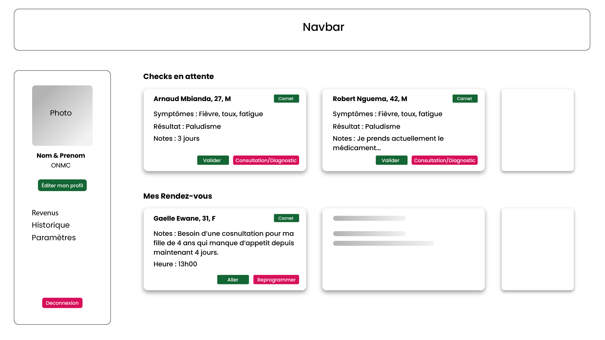

# ADE – Application de Diagnostic de Maladies

**ADE** (Assistant de Diagnostic Évolutif) est une application full-stack (Backend Node.js + Frontend React) permettant à un utilisateur adulte de saisir des symptômes et de recevoir un classement des maladies correspondantes. L'application offre également un espace personnel pour suivre ses consultations.

## 🚀 Prérequis

- **Node.js** ≥ 18.x
- **npm** ≥ 10.x
- **MySQL** (ou MariaDB) installé & accessible en local
- Un **compte GitHub** pour le versioning
- (Optionnel) une **clé API Google** si vous activez la recherche de pharmacies/établissements

## 📁 Structure du dépôt

```
ade/
├─ ade-backend/  # Backend Express + Sequelize
│  ├─ src/
│  ├─ .env                # variables d'environnement (non versionné)
│  └─ package.json
├─ ade-frontend/ # Frontend React + Vite
│  ├─ src/
│  ├─ .env                # variables d'environnement (non versionné)
│  └─ package.json
├─ .gitignore
└─ README.md  # ce fichier
```

---

## ✨ Fonctionnalités récentes

- Page d'accueil repensée avec une **Navbar** modernisée
- Ajout d'un **Tableau de bord Patient** pour suivre checks et rendez‑vous
- Ajout d'un **Tableau de bord Médecin** pour répondre aux checks et gérer sa disponibilité
- Meilleure accessibilité grâce aux styles `:focus-visible` sur les boutons et liens
- Correctifs d'authentification (en‑tête JWT systématique, gestion du token)
- Les checks déjà traités sont masqués côté médecin



## ⚙️ Installation & Démarrage

### 1. Cloner le dépôt

```bash
git clone git@github.com:mrpade/ade.git
cd ade
```

### 2. Backend

```bash
cd ade-backend
npm install
# Copier et compléter .env avec vos informations MySQL et JWT_SECRET
cp .env.example .env
# Lance le serveur (port 4000 par défaut)
npm run dev
```

L'API tourne sur <http://localhost:4000>.

### 3. Frontend

```bash
cd ../ade-frontend
npm install
# Copier et compléter .env avec VITE_API_URL et éventuellement VITE_GOOGLE_MAPS_API_KEY
cp .env.example .env
npm run dev
```

Le frontend est servi sur <http://localhost:5173/>.

## Variables d'environnement

Voir le fichier `.env.example` pour la liste complète et les clés attendues.

## 📚 Documentation

### Backend

Modèles Sequelize : `User`, `DiseasesList`, `Search` ainsi que `Question`, `QuestionOption`, `OptionImpact` et `UserQuestionResponse` pour la recherche interactive.

Routes principales :

- `/api/maladies?symptomes=...`
- `/api/maladies/interactive` (POST) – recherche interactive avec questions
- `/api/symptomes?q=...`
- `/api/pharmacies?lat=...&lng=...&filter=...`
- `/api/auth` & `/api/moncompte`

### Frontend

Pages : Home, Maladies, Pharmacies, Register, Login, **PatientDashboard**, **DoctorDashboard**, MonCompte

Composants : Navbar, SearchBar, CardMaladie, etc.

## 🤝 Contributions

Les contributions sont les bienvenues !

1. Fork ce dépôt
2. Crée une branche (`git checkout -b feat/ma-fonctionnalite`)
3. Commit tes changements (`git commit -m 'feat: ajout de …'`)
4. Push (`git push origin feat/ma-fonctionnalite`)
5. Ouvre une Pull Request

© 2025 ADE – Tous droits réservés
